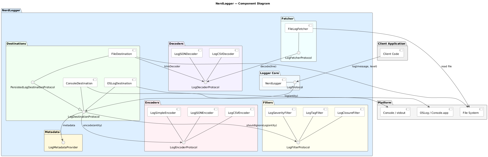
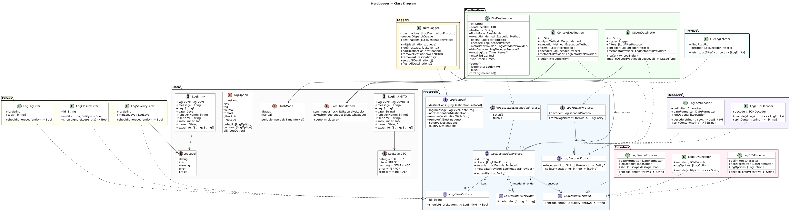
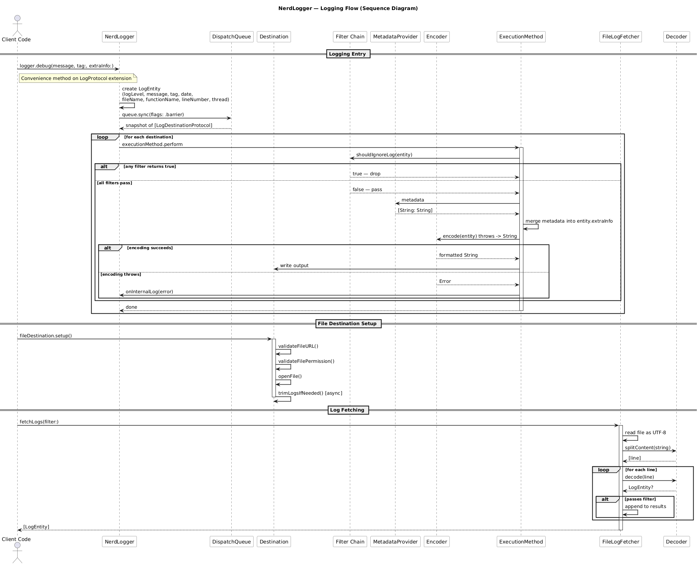
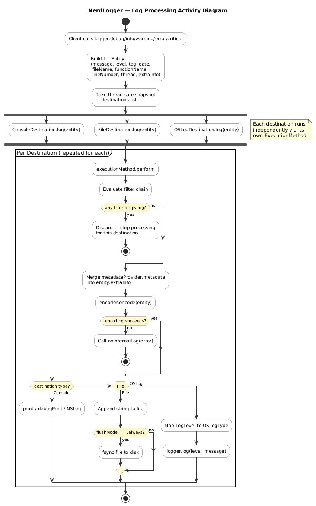
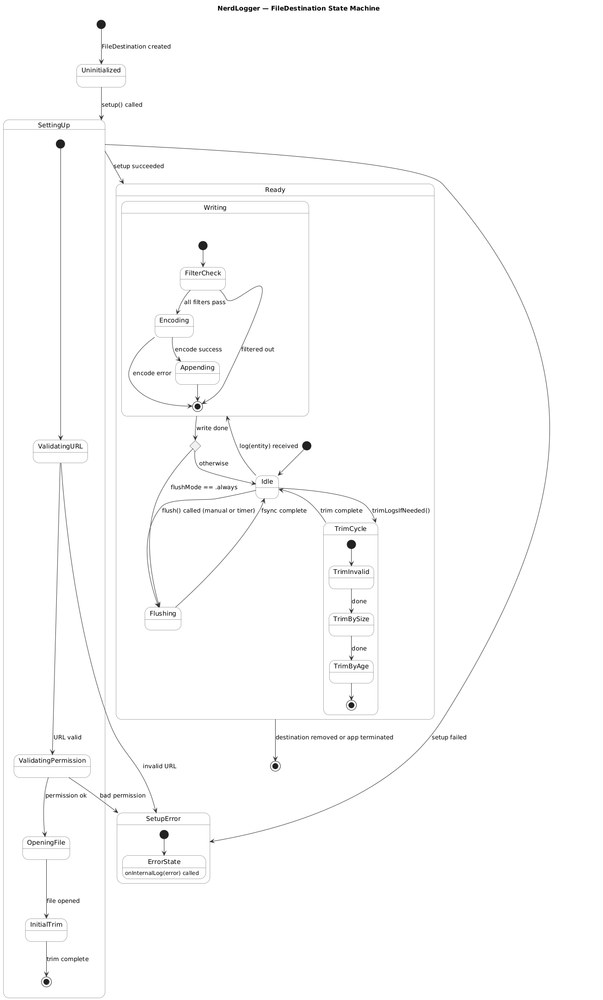

# NerdLogger

[](https://swift.org)
[](https://developer.apple.com/swift/)
[](https://swift.org/package-manager/)
[](LICENSE)

NerdLogger is a lightweight, protocol-oriented logging library for iOS and macOS built entirely with Swift. It is designed around the idea that different parts of an application may need to log in different ways — to the console during development, to a file for diagnostics, and to the system log for production — all simultaneously and with independent configuration.

Each **destination** owns its encoder, filter chain, execution strategy, and optional metadata provider. You compose what you need at initialisation time and the logger takes care of the rest: thread-safe fan-out, filtering, metadata injection, encoding, and writing, all without coupling your application code to any specific output.

Out of the box NerdLogger ships with three destinations (`Console`, `File`, `OSLog`), three encoding formats (`Simple`, `JSON`, `CSV`), three filter types (`Severity`, `Tag`, `Closure`), and a `FileLogFetcher` for reading persisted logs back at runtime.

## Features

- **Multiple destinations** — Console, OSLog, and File out of the box
- **Three encoders** — Simple text, JSON, and CSV
- **Configurable log options** — Choose which fields to include: timestamp, level, tag, thread, file info, extra info
- **Per-destination filters** — Filter by severity, tag, or an arbitrary closure
- **Metadata injection** — Attach shared key/value pairs to every log via `LogMetadataProvider`
- **File log management** — Automatic trimming by age and/or file size
- **Sync or async execution** — Choose per destination to balance debuggability and performance
- **Log fetching** — Read persisted logs back from file with optional filtering

## Requirements

- Swift 5
- iOS 17+ / macOS 14+

## Installation

Add NerdLogger to your `Package.swift`:

```swift
dependencies: [
    .package(url: "https://github.com/your-org/nerd-logger.git", from: "1.0.0")
]
```

Then add the product to your target:

```swift
.product(name: "NerdLogger", package: "nerd-logger")
```

## Quick Start

```swift
import NerdLogger

let encoder = LogSimpleEncoder(
    dateFormatter: {
        let f = DateFormatter()
        f.dateFormat = "yyyy-MM-dd HH:mm:ss"
        return f
    }(),
    logOptions: .console
)

let logger = NerdLogger(
    destinations: [
        ConsoleDestination(
            id: "console",
            outputMethod: .print,
            executionMethod: .synchronous(lock: NSRecursiveLock()),
            filters: [],
            encoder: encoder
        )
    ],
    queue: DispatchQueue(label: "com.app.logger", attributes: .concurrent)
)

logger.debug("App launched")
logger.info("User signed in", tag: "Auth")
logger.error("Request failed", extraInfo: ["url": "/api/items"])
```

For detailed examples covering all destinations, encoders, filters, and log fetching, see [USAGE.md](docs/USAGE.md).

## Architecture

| Layer | Types | Role |
|---|---|---|
| **Logger** | `NerdLogger`, `LogProtocol` | Entry point; routes log entries to all destinations |
| **Destinations** | `ConsoleDestination`, `OSLogDestination`, `FileDestination` | Where log output is sent |
| **Encoders** | `LogSimpleEncoder`, `LogJSONEncoder`, `LogCSVEncoder` | How a `LogEntity` is serialised to a string |
| **Filters** | `LogSeverityFilter`, `LogTagFilter`, `LogClosureFilter` | What gets through to a destination |
| **Fetcher** | `FileLogFetcher` | Reads and decodes persisted log files |

Each destination holds its own encoder, filter list, and optional metadata provider, so different destinations can format and filter independently.

### Component Overview



### Class Diagram



### Logging Flow



### Log Processing Activity



### FileDestination State Machine



> PlantUML source files are in [`docs/diagrams/`](docs/diagrams/).

## Contributing

Contributions are welcome! Please read [CONTRIBUTING.md](CONTRIBUTING.md) before submitting a pull request.

## License

NerdLogger is released under the [MIT License](LICENSE).
